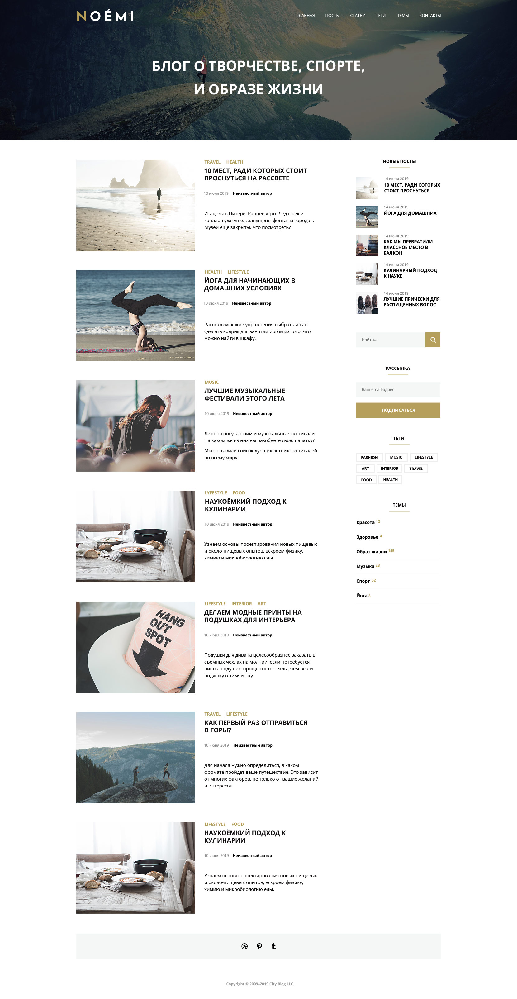

# Итоговая работа по модулю "HTML-верстка: с нуля до первого макета"

Данный проект выполнен в рамках обучения на курсе по HTML и CSS от Нетологии.  
Цель проекта — сверстать адаптивный сайт по готовому макету.

🔗 Задание по модулю доступно [по ссылке](https://github.com/netology-code/html-2-diploma). 
📌 Посмотреть проект онлайн на [GitHub Pages](https://potykalov.github.io/html-2-diploma/).

## 📌 О проекте

Сайт представляет собой блог о стиле жизни, включающий:
- главную страницу с постами
- боковую панель с дополнительной информацией
- блоки с трендовыми постами
- форму подписки и поиска
- адаптивную верстку под разные устройства

## 🚀 Технологии

- HTML
- CSS
- Flexbox
- Media Queries (адаптивная верстка)

## 📱 Адаптивность

Проект корректно отображается на:
- десктопах
- планшетах
- мобильных устройствах

## 🛠️ Что реализовано

- семантическая верстка
- адаптивный дизайн
- работа с фоновыми изображениями
- стилизация форм
- hover-эффекты
- кастомные шрифты

## 📂 Структура проекта

    .
    ├── index.html
    ├── style.css
